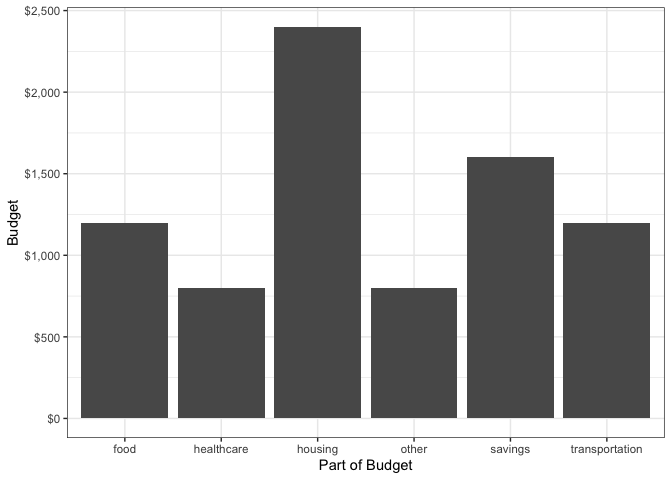

<!-- README.md is generated from README.Rmd. Please edit that file -->

# betterBudgets

<!-- badges: start -->
<!-- badges: end -->

The goal of the betterBudgets package is to help users better manage
their budgets. It takes the user’s income (of any currency) as input and
then calculates how much they should spend on healthcare, housing,
savings, and so on. It also provides them with personalized
recommendations for specific budgets. There is, for example, a function
that provides housing recommendations based on the state, annual income,
and the desired type of housing.

## Installation

You can install the development version of betterBudgets from
[GitHub](https://github.com/) with:

``` r
# install.packages("devtools")
devtools::install_github("Adv-R-Programming/final-project-better-budgets")
```

If you get a warning that says that “qpdf is needed,” install qpdf.

## Example

This is a basic example which shows you how to use the individual
budgeting functions:

``` r
library(betterBudgets)
# calling transportation_budget for a user with a monthly income of $8000, requesting additional saving tips, and saving recommendations. To request saving recommendations the user must also provide their monthly distance, along with their car consumption, and the cost of fuel.
transportation_budget(8000, tip = TRUE, rec = TRUE, dist = 800, consump = 25, cpg = 3 )
#> Budgeting Tips: 
#> Carpool with friends or co-workers. 
#> Walk or bike when possible. 
#> Consider using public transportation. 
#> Transportation recommendations: 
#> The average cost of fuel for  800  miles is about $ 96 . With your current budget you could travel 10000 miles per month.
#> The average cost of public transportation is about $ 60 
#> The average time to walk  800  miles is about  266.6667  hours 
#> The average time to bike  800  miles is about  66.66667  hours
#> [1] 1200

# calling food_budget for a user with a monthly income of $8000. Returns the recommended food spending for an individual with a monthly income of $8000, along with food saving tips, and splitting the food budget further into two categories: groceries and takeout
food_budget(8000, tip = TRUE, food_split = TRUE)
#> Budgeting Tips:
#> Buy food items on sale and use coupons when you can.
#> Plan your meals, create a grocery list, and adhere strictly to your grocery list.
#> Buy generic brands, and compare prices across stores and brands to determine cheapest price.
#>   income food_budget groceries takeout
#> 1   8000        1200       680     520

# calling healthcare_budget for a user with a monthly income of $8000. Returns the recommended healthcare spending for an individual with a monthly income of $8000
healthcare_budget(8000)
#>   income healthcare_budget
#> 1   8000               800

# calling housing_budget for a user with a monthly income of $8000. Returns the recommended housing spending for an individual with a monthly income of $8000 along with saving tips
housing_budget(8000, tip = TRUE)
#> Budgeting Tips:
#> Live with a roommate and divide the cost of housing.
#> Downsize to a smaller home.
#> If you have a mortgage: Consider refinancing your mortgage. Changing your type of mortgage or finding a lower interest rate may be able to decrease your monthly payments.
#>   income housing_budget
#> 1   8000           2400

# calling other_budget for a user with a monthly income of $8000. Returns the recommended other spending for an individual with a monthly income of $8000
other_budget(8000)
#>   income other_budget
#> 1   8000          800

# calling savings_budget for a user with a monthly income of $8000. Returns the recommended savings for an individual with a monthly income of $8000
savings_budget(8000)
#>   income savings_budget
#> 1   8000           1600
```

We also have an interactive monthly budget function that combines all
the individual budget functions and creates a monthly budget for the
user.

``` r
# returns a monthly budget for an income of $8000. Additionally, the users can specify which categories are most important to them by rating each category from 1-6. The percent of income for each category will vary depending on the level of importance attributed to it. The results will then be displayed in a bar graph
monthly_budget_more (8000, interactive = FALSE )
#> $budget
#>             type budget
#> 1        housing   2400
#> 2           food   1200
#> 3 transportation   1200
#> 4     healthcare    800
#> 5        savings   1600
#> 6          other    800
#> 
#> $bar_plot
```



# Overview

The main components of this package include functions that calculate a
recommended or self-selected budget for the following categories:
housing, healthcare, food, transportation, savings, and other. In
addition to these functions, there are also functions that provide
housing recommendations based on location and income, as well as a
function that provides tips on how to save money. The individual
budgeting functions are smaller, and are used together in the helper
function: monthly_budget_more(). This function along with a function
that takes user input (interact()), are used in the main function
do_both(), and allows the user input their income, rate the importance
of the different budget components to set their percentages (or use the
recommended budget percentages), and run calculations for each of the
budget components to output their spending allotment for each budget
component. Please see the vignette “Interactive Monthly Budget” to get a
more detailed description of the functionality and uses of the
interact(), monthly_budget_more(), and do_both() functions. The
“Advanced Functions” vignette will give you a more detailed description
of the advanced functionalities of the transportation_budget() and
food_budget() functions.
